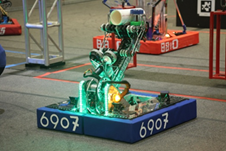

## 机器性能概述

本机器参加了2025年季后赛，在资格赛中排名第8。整车完全复制了世界冠军2910的机器，是一台全功能的机器。机器调试稳定后，自动阶段稳定2筒；手动阶段放筒成功率100%，平均cycle时长5.5s；可稳定爬升低笼，平均用时7秒。

<!-- {: width="600px"}
 -->

本机器人采用集成式设计，全车除Drivetrain外所有的得分机构全部依附于Arm上。因此，我们极力简化了Arm与Drivetrain的连接，机械上仅使用螺栓和死轴套筒连接，电气上使用WAGO 221系列快拆连接器。经过训练之后，Pit Crew可以在20分钟内更换Arm部件。

## 三自由度Arm

Arm是本机器人上层机构的总称，可以分为Pivot、Extension、Wrist三个驱动自由度，以及End Effector、Climber两个功能性组件。通过为期近一个月的调试，我们能够做到在1s之内使机械臂达到可动范围内的任何位置。

## 全得分功能End Effector

End Effector是Arm承载的最重要的得分机构，采用Andymark和WCP公司的胶轮与CTRE的CANRange传感器相结合，实现横向Coral（L1）、竖向Coral（L2、3、4）、Algae（Processor、Barge）的稳定且迅速的抓取。

## 稳定高效Climber

Climber是Arm承载的另外一个得分机构，拥有2个胶轮以抓取笼子的一个柱子，在抓取后有锁扣将其固定住，随后使用Pivot下拉整个笼子，再使用Extension1级嵌入底盘卡槽，达成爬升的目的，可在极端的晃动下维持Disable后3s的稳定爬升。另外，Climber在Arm上具有一个线性自由度，在Pivot下拉后调节重心位置。
